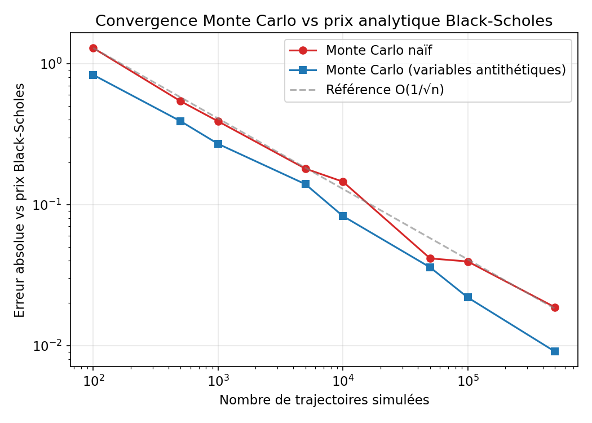
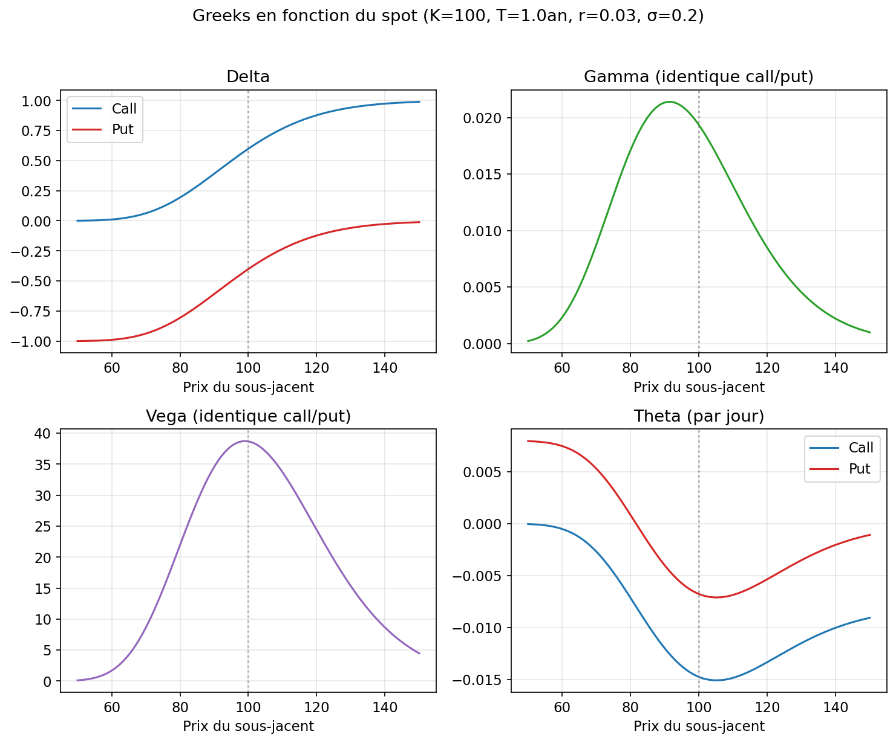
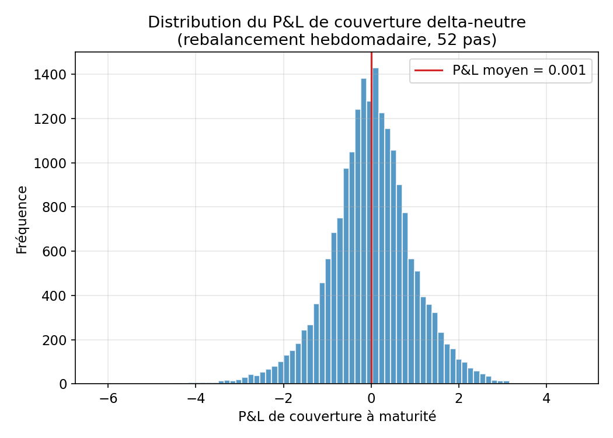
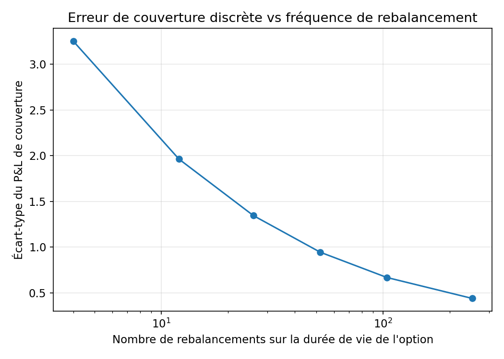

# Options Pricing — Black-Scholes, Monte Carlo & couverture delta

Projet perso pour appliquer et mettre en pratique les bases du pricing d'options : formule de Black-Scholes, pricing par simulation Monte Carlo (avec une technique de réduction de variance), calcul des Greeks, et une simulation de couverture delta pour voir concrètement ce que ça donne quand on rebalance à intervalles discrets plutôt qu'en continu.

## Contenu

```
options-pricing/
├── README.md
├── requirements.txt
├── run_all.py
├── src/
│   ├── black_scholes.py     # prix + Greeks (delta, gamma, vega, theta, rho)
│   ├── monte_carlo.py       # pricing MC (naif + antithetique) + etude de convergence
│   ├── hedging.py           # simulation de couverture delta discrete
│   └── generate_plots.py    # genere les graphes ci-dessous
└── plots/
    ├── mc_convergence.png
    ├── greeks.png
    ├── hedging_pnl_distribution.png
    └── hedging_error_vs_frequency.png
```

## Ce que fait chaque partie

**Black-Scholes** : les formules fermées classiques pour un call/put européen, plus les Greeks calculés analytiquement (pas par différences finies).

**Monte Carlo** : je simule directement le prix terminal du sous-jacent (solution exacte du mouvement brownien géométrique, donc pas de biais de discrétisation), et je compare deux estimateurs : Monte Carlo naïf, et Monte Carlo avec variables antithétiques (pour chaque tirage Z, on utilise aussi -Z, ce qui réduit la variance sans biaiser le résultat).

**Couverture delta** : je simule un trader qui vend une option, encaisse la prime Black-Scholes, et couvre en détenant `delta` actions du sous-jacent, rebalancées à intervalles réguliers (hebdomadaire par défaut). En théorie continue cette réplication est parfaite. En pratique, avec un rebalancement discret, il reste une erreur résiduelle — c'est ce que je mesure ici.

## Résultats

### Convergence Monte Carlo
Erreur moyenne (sur 30 runs) entre le prix Monte Carlo et le prix Black-Scholes, selon le nombre de trajectoires simulées.



La méthode antithétique converge plus vite que la méthode naïve à nombre de tirages égal.

### Greeks
Pour K=100, T=1 an, r=3%, sigma=20% :



### Distribution du PnL de couverture
20 000 simulations, rebalancement hebdomadaire (52 pas sur l'année) :



Le PnL moyen est proche de zéro (couverture non biaisée), mais l'écart-type montre le risque résiduel du rebalancement discret.

### Erreur de couverture vs fréquence de rebalancement



Logique : plus on rebalance souvent, plus l'écart-type du PnL diminue (au prix, en pratique, de coûts de transaction plus élevés — pas modélisés ici).

## Pour lancer le projet

```bash
pip install -r requirements.txt
python run_all.py
```

Ou en important les fonctions directement :

```python
import sys
sys.path.insert(0, "src")

from black_scholes import bs_price, delta, gamma, vega, theta
from monte_carlo import mc_price
from hedging import simulate_delta_hedge

price = bs_price(S=100, K=100, T=1.0, r=0.03, sigma=0.2, option_type="call")
mc_estimate, std_error = mc_price(S=100, K=100, T=1.0, r=0.03, sigma=0.2,
                                   option_type="call", n_paths=100_000)
```

## Limites / pistes d'amélioration

- Volatilité constante (pas de smile) — un modèle Heston ou local vol serait la suite logique
- Pas de coûts de transaction dans la simulation de couverture
- Options européennes seulement (pas d'exercice anticipé)
